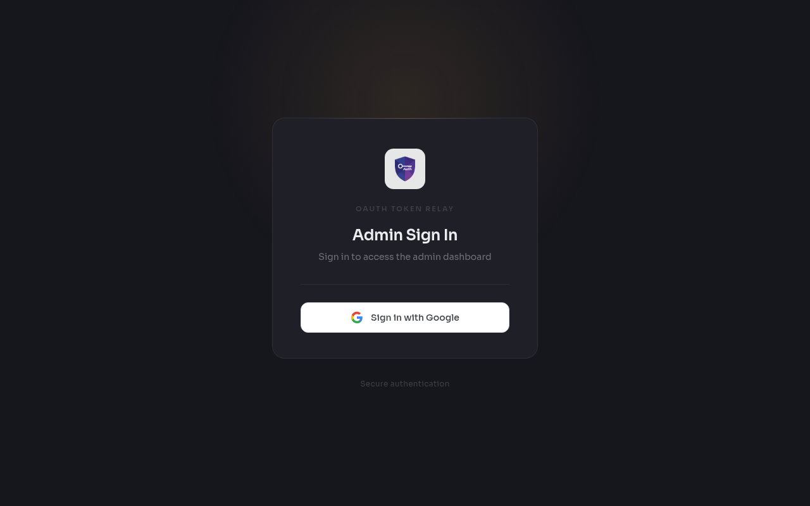
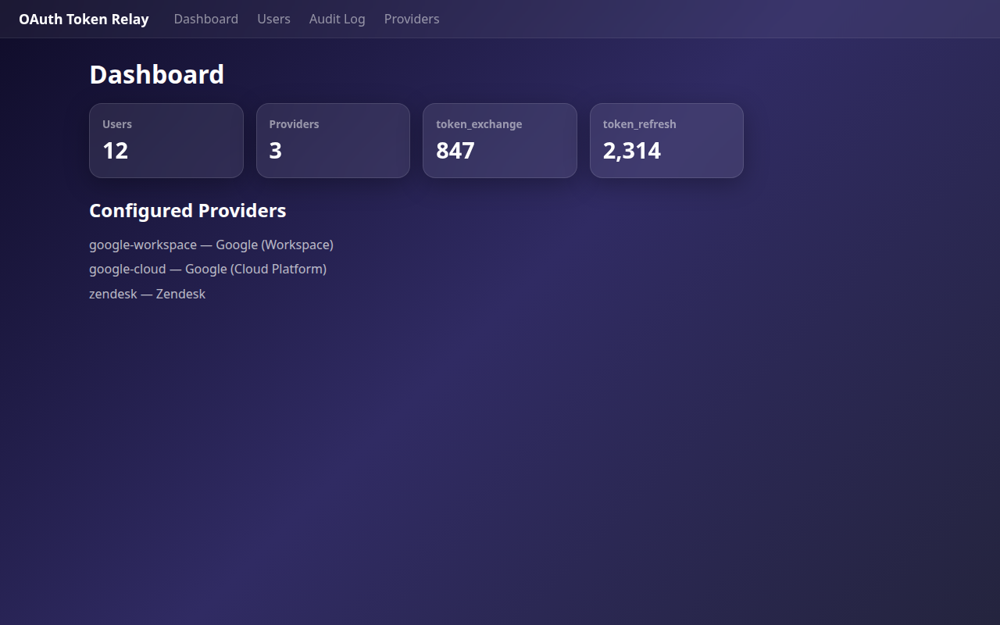
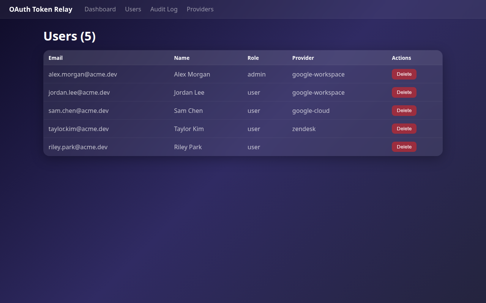

# OAuth Token Relay

Generic OAuth 2.1 authorization server + multi-provider OAuth 2.0 token relay.

Centralizes OAuth credential management: the server holds `client_secret`, clients hold tokens. The server facilitates OAuth flows but is never in the data path — API calls go directly from clients to providers.

## How It Works

```
CLI                         Relay Server                  Google / GitHub / etc.
 |                               |                               |
 |-- PKCE auth (SSO login) ---->|                               |
 |<-- server JWT ---------------| (identity verified via SSO)   |
 |                               |                               |
 |-- start relay (JWT) -------->|                               |
 |<-- auth_url -----------------| (provider consent URL)        |
 |                               |                               |
 |   [browser: user consents]   |-- exchange code ------------->|
 |                               |<-- access + refresh tokens --|
 |                               |                               |
 |-- complete (JWT) ----------->|                               |
 |<-- tokens (one-time) --------| (deleted from memory)         |
 |                               |                               |
 |-- API calls directly ------------------------------------------->|
```

**Two layers of auth:**

1. **Identity** — CLI authenticates to the relay server via OAuth 2.1 PKCE + SSO (Google, GitHub, etc.). The server issues JWTs.
2. **API access** — CLI requests upstream provider tokens through the relay. The server holds `client_secret` and performs the OAuth exchange. Tokens are delivered once and held only in memory briefly.

## Screenshots

| Login | Dashboard | Users |
|-------|-----------|-------|
|  |  |  |

## Quick Start

```bash
# 1. Copy and edit config
cp config.example.yaml config.yaml

# 2. Set required environment variables
export JWT_SIGNING_KEY=$(openssl rand -base64 32)
export GOOGLE_IDP_CLIENT_ID=...       # Identity provider (for SSO login)
export GOOGLE_IDP_CLIENT_SECRET=...
export GOOGLE_CORP_CLIENT_ID=...      # Relay provider (for API tokens)
export GOOGLE_CORP_CLIENT_SECRET=...

# 3. Run
go run ./cmd/oauth-token-relay -config config.yaml
```

The server starts on `:8085` by default. Visit `http://localhost:8085/` to access the admin dashboard.

## Configuration

See [`config.example.yaml`](config.example.yaml) for all options. Key sections:

| Section | Purpose |
|---------|---------|
| `server` | Address, timeouts |
| `storage` | SQLite |
| `jwt` | Signing key, issuer, token TTLs |
| `providers` | Upstream OAuth providers for token relay (Google, Zendesk, etc.) |
| `identity_providers` | SSO providers for user login (Google, GitHub, etc.) |
| `admin.bootstrap_admins` | Email addresses auto-promoted to admin on first SSO login |
| `backup` | Optional S3 backup for SQLite |

Environment variables in config values (e.g. `${JWT_SIGNING_KEY}`) are expanded at load time.

## Provider Setup

Each upstream provider (Google, Zendesk, etc.) needs an OAuth client registered on the provider's side. The relay constructs the callback URL as:

```
http://<relay-host>:<port>/auth/tokens/callback
```

**The OAuth client must be `confidential` (not `public`).** The relay is a server-side component that securely holds the `client_secret`. If the provider's OAuth client is set to "public", the authorize endpoint may require PKCE parameters that the relay doesn't send for upstream flows, causing `invalid_request` errors.

### Google Workspace

1. Go to [Google Cloud Console](https://console.cloud.google.com/) -> APIs & Services -> Credentials
2. Create an **OAuth 2.0 Client ID** (Web Application)
3. Add redirect URI: `http://localhost:8085/auth/tokens/callback`
4. Copy Client ID and Client Secret to `GOOGLE_CORP_CLIENT_ID` and `GOOGLE_CORP_CLIENT_SECRET` env vars
5. The `extra_params` with `access_type: "offline"` and `prompt: "consent"` ensure refresh tokens are issued on every consent

### Zendesk

1. Go to **Zendesk Admin Center** -> Apps & Integrations -> APIs -> OAuth Clients
2. Create a new OAuth client
3. Set a unique identifier (this becomes the `client_id`)
4. **Set Client Kind to "Confidential"** -- "Public" requires PKCE which the relay doesn't send for upstream flows, causing `invalid_request` errors
5. Add redirect URI: `http://localhost:8085/auth/tokens/callback`
6. Copy the generated Client Secret to the `ZENDESK_CLIENT_SECRET` env var

### CLI Configuration

Once the relay is running and providers are configured, point CLIs at it:

**gws-cli (Google Workspace):**

```bash
gws-cli config set-mode server \
  --url http://localhost:8085 \
  --provider google-corp \
  -a myaccount

gws-cli auth server-login -a myaccount
gws-cli drive list -a myaccount --max-results 3
```

**zd-cli (Zendesk):**

```bash
zd-cli auth set-mode \
  --mode server \
  --url http://localhost:8085 \
  --provider zendesk \
  --subdomain YOUR_SUBDOMAIN

zd-cli auth server-login
zd-cli me
```

## API Endpoints

### SSO + OAuth 2.1 AS

| Method | Path | Auth | Purpose |
|--------|------|------|---------|
| `GET` | `/oauth/login` | - | SSO login page (for CLI PKCE flow) |
| `GET` | `/admin/login` | - | SSO login page (for admin dashboard) |
| `GET` | `/sso/start/{provider}` | - | Redirect to identity provider |
| `GET` | `/sso/callback` | - | Identity provider callback |
| `GET` | `/oauth/authorize` | session | PKCE authorization endpoint (Fosite) |
| `GET` | `/oauth/cli-callback` | - | Stores auth code for CLI polling |
| `GET` | `/oauth/cli-poll` | - | CLI polls for auth code |
| `POST` | `/oauth/token` | - | Code exchange / refresh (issues server JWTs) |
| `POST` | `/oauth/revoke` | - | Revoke server tokens |

### Token Relay

| Method | Path | Auth | Purpose |
|--------|------|------|---------|
| `POST` | `/auth/tokens/start` | JWT | Start upstream OAuth flow |
| `GET` | `/auth/tokens/callback` | - | Provider callback (browser redirect) |
| `POST` | `/auth/tokens/complete` | JWT | Poll/retrieve upstream tokens |
| `POST` | `/auth/tokens/refresh` | JWT | Refresh upstream token via server |
| `POST` | `/auth/tokens/revoke` | JWT | Revoke upstream token |

### Admin

| Method | Path | Auth | Purpose |
|--------|------|------|---------|
| `GET` | `/admin/` | admin | Dashboard UI |
| `GET` | `/admin/api/users` | admin | List users |
| `GET` | `/admin/api/users/{id}` | admin | Get user |
| `DELETE` | `/admin/api/users/{id}` | admin | Delete user |
| `POST` | `/admin/api/users/{id}/assign-provider` | admin | Assign relay provider to user |
| `GET` | `/admin/api/usage` | admin | Usage statistics |
| `GET` | `/admin/api/audit` | admin | Audit log |
| `GET` | `/admin/api/providers` | admin | List relay providers |
| `GET` | `/health` | - | Health check |

## Architecture

```
cmd/oauth-token-relay/     Entry point, route wiring
internal/
  auth/                    JWT service, OAuth 2.1 server (Fosite), session manager, middleware
  config/                  YAML config loading with env var expansion
  handler/                 HTTP handlers: SSO, OAuth, relay, admin API
  idp/                     Identity provider abstraction (SSO login)
  provider/                Upstream OAuth provider abstraction (token relay)
  server/                  HTTP server with graceful shutdown, security headers
  store/                   SQLite storage: users, providers, sessions, audit, usage
  admin/ui/                Embedded admin dashboard (HTML templates + static assets)
  httputil/                JSON request/response helpers
k8s/                       Kubernetes deployment manifests
```

## S3 Backup

When `backup.enabled` is true, the server backs up the SQLite database to S3 periodically. This allows a fresh container (or a new instance after data loss) to recover state automatically.

**Startup sequence:**

1. Acquire distributed lock in S3 (prevents concurrent backups)
2. If a backup exists in S3, **restore it to the local path** (overwrites any local DB)
3. Open the SQLite database and run migrations
4. Start heartbeat (1 min) and periodic backup (default 30 min)

**Important:** The S3 backup always takes priority over the local copy on startup. If you need to discard the S3 backup and start fresh, delete the backup object from S3 before starting the server.

**Periodic backups** only upload when the database file has been modified since the last backup. On graceful shutdown (SIGTERM/SIGINT), a final backup is performed and the lock is released.

**Distributed lock:** An S3-based lock (`{prefix}lock.json`) prevents multiple instances from backing up simultaneously. The lock has a 1-minute heartbeat and a 5-minute stale timeout. If an instance crashes without releasing its lock, other instances will take over after 5 minutes.

**AWS credentials** are resolved via the default chain: `AWS_ACCESS_KEY_ID`/`AWS_SECRET_ACCESS_KEY` environment variables, `~/.aws/credentials`, or IAM roles (EC2/ECS/EKS).

## Security

- Upstream tokens are **never persisted to the database** — held in memory for max 5 minutes, delivered once, then deleted
- OAuth 2.1 with **mandatory PKCE** (S256) for all authorization code flows
- Server JWTs with **refresh token rotation** (old token deleted atomically on use)
- **SSO-only authentication** — no password/email login; users prove identity via external provider
- Session cookies are **encrypted** (AES-GCM) and scoped by path
- **CSP headers**: `default-src 'self'` with explicit allowlists for fonts
- **Auto-provisioning**: first login creates a user account; bootstrap admins configured via config

## Development

```bash
# Run tests
go test ./...

# Run with race detector
go test -race ./...

# Build
go build -o oauth-token-relay ./cmd/oauth-token-relay

# Run locally
cp .env.test .env && set -a && source .env && set +a
go run ./cmd/oauth-token-relay -config config.yaml
```
